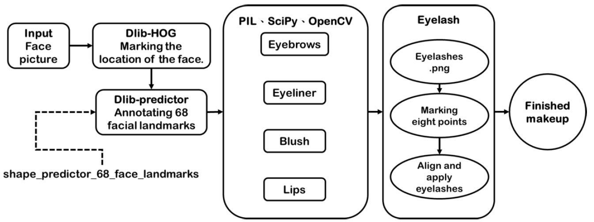
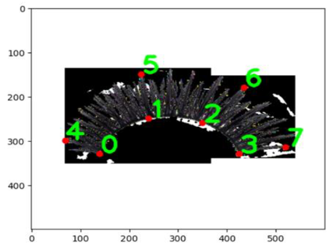
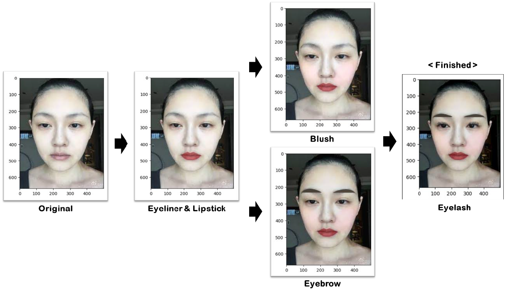

# Face-Makeup-Application_in_class_multimedia_information_systems
多媒體系統課程_FinalProject_臉部化妝

### System Framework

### 68 Facial Feature Points

### 8 Facial Landmark Points for Eyelashes

### Face Makeup Process

